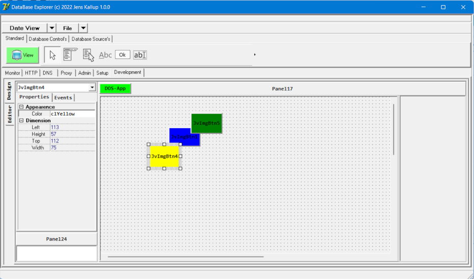
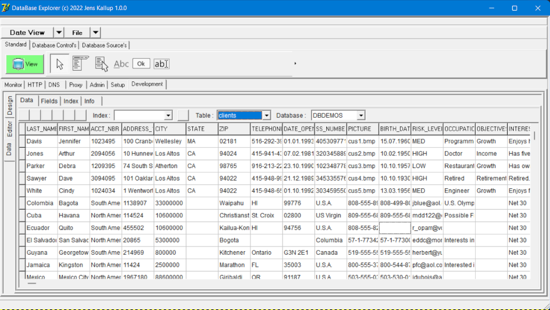
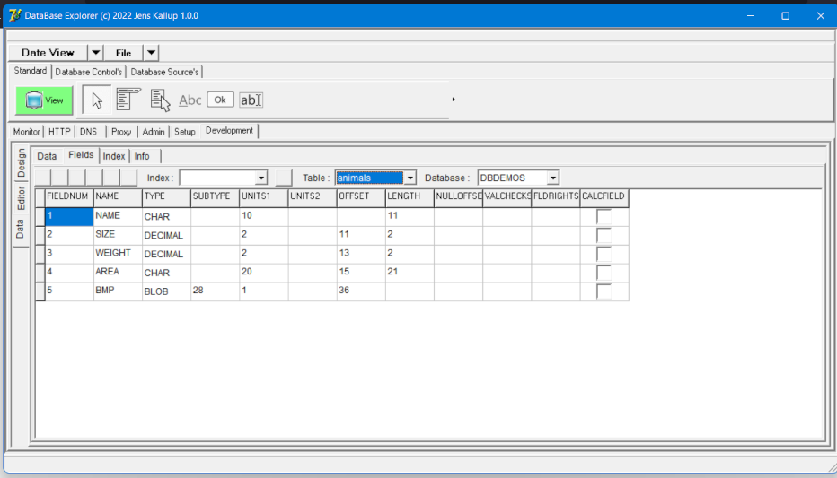
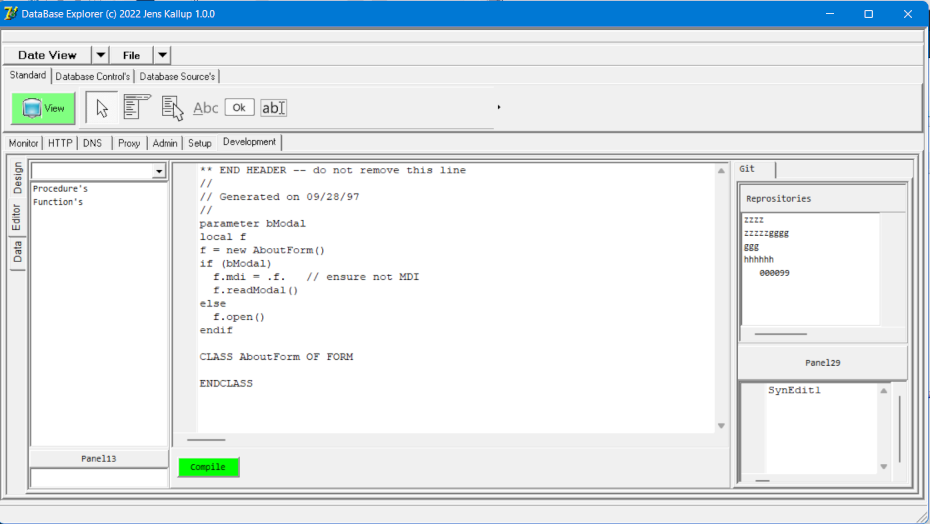
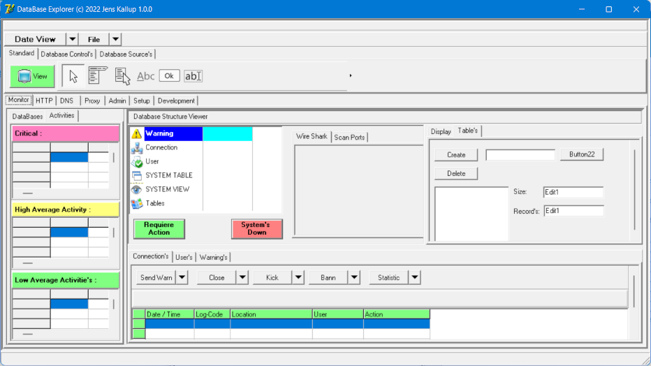
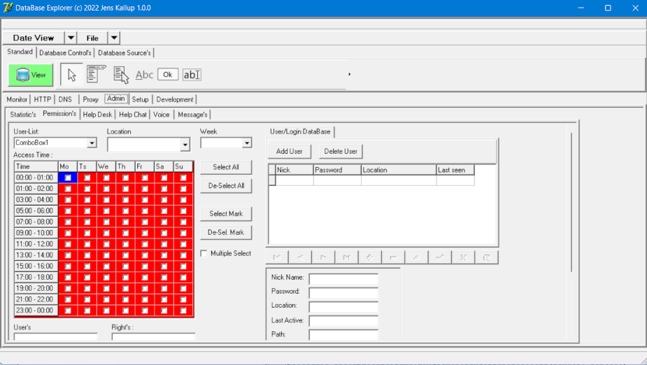

# dBASE_BDE
A Control Panel Application for working with dBASE database files as mini server with
user management plus many more options, coming soon (login, apache configurator, ...
take a look to the template application for a preview - thank's) - for free
(please give me a donut :-)

I have start this OpenSoftware Project, to make a re-new to the popular dBASE Product,
but with new Ideas in the way, that Customer should come back to the day's where dBASE
was a wide favorite and great Database Product for Mini-Computers.

I can not say if will be success the Project, or finished at a Time.

But I initialte the Project, to help people that can not pay a big programming
Development System in they Country.
This involves help in different Languages - German, and English.

The only fact that You have a must in is Fun, Time, and Respect.

So, You should be fair enough to give me Time to implement things, that can
be used by Everyone in the same way.
This helps us all, to go Step by Step in a New, Good, and Qualtity Community.

But You must know, that I can not Re-Programming the old dBASE as the
Origion. They are Trademarks, and other Right that binding Everyone to NOT
using the same Name "dBASE" with the same Product Line Expression's.

So we, as Community, have to found a new Name for Our new Product.
And there You are involved, to make ideas.
Tell me more of Your needs, dreams, of a good Development Tool.

So I will End-Up my Welcome to the new Community Member's, and hope
You can understand, and follow my way of Software production.

You can follow the Process at my GitHub.com account, download Sources,
and many many more.

You can find a Wiki for Diskussions, and Help.
A working Pre-Alpha-Template compiled Version of the latest Release for:

* Windows 10/11 32-Bit, and
* Windows 10/11 64-Bit

I have tested both Architektures (32/64-Bit), and *all* are working.
I will not say or write to much, because I will not lost you, but till there:

Thanks for reading, and thanks for Your trust.
paule32 

